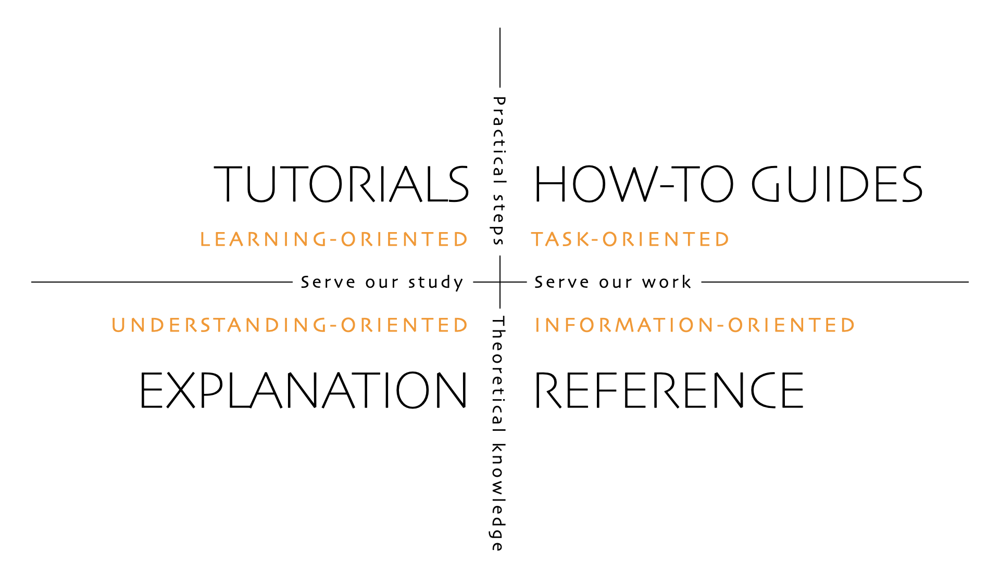

.. _how-to-apply-diataxis:

How apply Diátaxis
===================

This section discusses techniques for applying Diátaxis to your work.

Sometimes, it's perfectly obvious what a certain piece of documentation is, or
ought to be; sometimes it's much less easy to be clear whether it's one thing or another. Even strong intuitions about it can be misleading.

Using Diátaxis is not a matter of placing different pieces of documentation
into different categories. The imperative, always, is to understand user need
and how documentation will serve it.

The axes of the framework's 4-way structure give us two questions to ask about
any particular piece of documentation.

The first concerns the horizontal axis: does (or should) this documentation
provide the user with *practical steps* or *theoretical information*?

The second concerns the vertical axis: does (or should) this documentation
serve the user's *acquisition* (i.e. study) or their *application* of knowledge
and skill (i.e. work)?

The first question is usually much more obvious to answer, so start with that.

If it's concerned with practical steps, then you know that you're dealing with
tutorial or how-to material. If it's concerned with theoretical information, then you know that you're dealing with reference or explanation.

Now you can consider whether it's something that someone who is